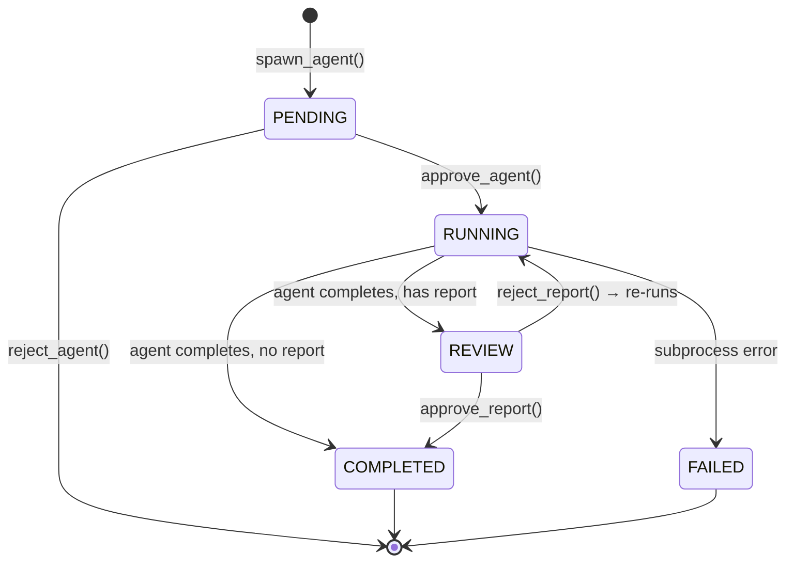
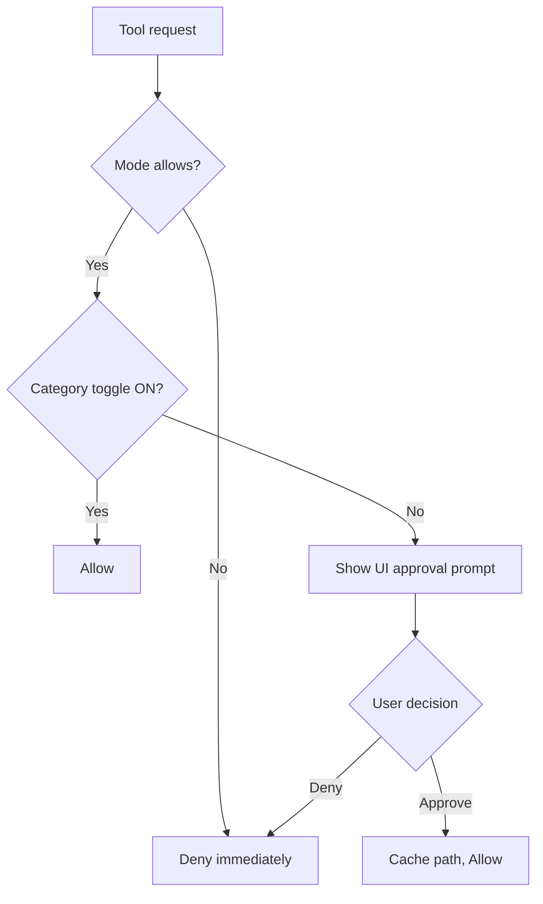
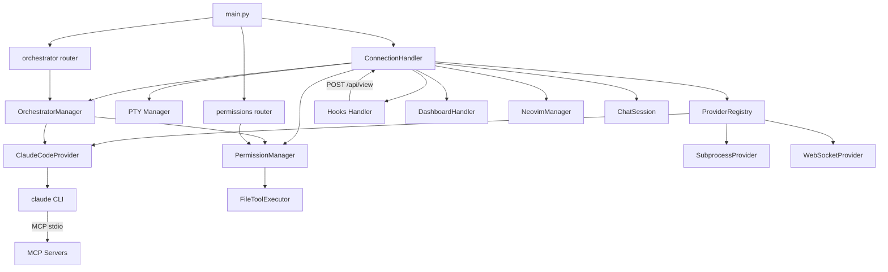

# Component Inventory

Full inventory of every significant component in CADE, with location, responsibility, and dependency relationships.

## Backend Components

### ConnectionHandler

| Field | Value |
|-------|-------|
| File | `backend/websocket.py` (~1,957 lines) |
| Entry | `ConnectionHandler.handle()` |
| Responsibility | Manages one WebSocket connection lifecycle — authentication, project routing, message dispatch, PTY lifecycle, chat streaming, file ops, Neovim, dashboard, agent events, permission prompts |

**Key methods:**

- `handle()` — Top-level connection loop; authenticates, calls `_setup()`, then runs receive/PTY output loops concurrently
- `_setup()` — Spawns PTY, starts file watcher, initialises provider registry and permission manager
- `_handle_message()` — Routes incoming WebSocket messages to sub-handlers by type
- `_stream_chat_response()` — Opens a provider stream and forwards `ChatEvent` objects to the client
- `_pty_output_loop()` — Reads PTY output bytes and sends them as OUTPUT messages

**Depends on:** `Config`, `ProviderRegistry`, `PermissionManager`, `OrchestratorManager`, `FileToolExecutor`, `NeovimManager`, `DashboardHandler`, `ChatSession`

**Depended on by:** FastAPI route in `main.py`

---

### FastAPI Application (`main.py`)

| Field | Value |
|-------|-------|
| File | `backend/main.py` (~1,174 lines) |
| Entry | `create_app()` → ASGI app; `main()` → CLI |
| Responsibility | Mounts all HTTP routes, WebSocket endpoint, static files, auth middleware; CLI parsing for `serve`/`view`/`setup-hook` subcommands |

**REST API groups:**

| Prefix | Module | Purpose |
|--------|--------|---------|
| `/api/orchestrator/` | orchestrator router | Agent spawn, approve, reject, status |
| `/api/permissions/` | permissions router | Prompt-and-wait, approve, deny, state, set |
| `/api/view` | inline | Receive hook POST, broadcast VIEW_FILE |
| `/api/neovim/` | neovim router | Diff endpoints |
| `/ws` | websocket handler | Main WebSocket connection |
| `/` | StaticFiles | Serves `frontend/dist/` |

**Depends on:** All backend subsystem modules

---

### OrchestratorManager

| Field | Value |
|-------|-------|
| File | `backend/orchestrator/manager.py` (~400 lines) |
| Responsibility | Spawns AI agent subprocesses, manages two-gate approval flow (spawn approval + report approval), tracks agent state, routes output to owning connection only |

**Agent lifecycle:**

**Key methods:**

- `spawn_agent(spec)` → `AgentRecord` in PENDING state
- `approve_agent(agent_id)` → starts `ClaudeCodeProvider` subprocess
- `await_completion(agent_id)` → blocks until COMPLETED/FAILED
- `approve_report()` / `reject_report()` → gate on final summary review

**Depends on:** `PermissionManager`, `ClaudeCodeProvider`

**Depended on by:** `ConnectionHandler`, orchestrator HTTP router

---

### PermissionManager

| Field | Value |
|-------|-------|
| File | `backend/permissions/manager.py` (~400 lines) |
| Responsibility | Single source of truth for current mode, category toggles, and interactive approval requests |

**Permission model:**

**Toggles:** `allow_read`, `allow_write`, `allow_tools`, `allow_subagents`, `auto_approve_reports`

**Modes:** `code`, `architect`, `review`, `orchestrator`

**Tool classification:**

- READ_TOOLS: `Read`, `Glob`, `Grep`, `LS`, `list_directory`, `View`, `Cat`
- WRITE_TOOLS: `Write`, `Edit`, `MultiEdit`, `Create`, `Delete`, `Move`, `Rename`

**Depends on:** `asyncio.Event` (for blocking approval), WebSocket sender reference

**Depended on by:** `ConnectionHandler`, `FileToolExecutor`, `OrchestratorManager`, permissions HTTP router

---

### ProviderRegistry

| Field | Value |
|-------|-------|
| File | `backend/providers/registry.py` |
| Responsibility | Manages provider instances; resolves global vs project-local providers; handles provider switching |

**Resolution order:** project-local (`launch.yml`) → global (`~/.cade/providers.toml`) → default

**Depended on by:** `ConnectionHandler`, orchestrator

---

### ClaudeCodeProvider

| Field | Value |
|-------|-------|
| File | `backend/providers/claude_code_provider.py` |
| Responsibility | Spawns `claude` CLI as a subprocess with `--output-format stream-json`; parses NDJSON event stream; emits typed `ChatEvent` objects |

**Supported CLI flags:**

- `--resume <session-id>` — Resume existing CC session
- `--permission-prompt-tool` — Route permission prompts to CADE's HTTP endpoint
- `--allowedTools` / `--disallowedTools` — Mode-aware tool filtering
- `--permission-mode acceptEdits` — Auto-approve file edits when `allow_write=True`

**Emitted event types:** `TextDelta`, `ThinkingDelta`, `ToolUseStart`, `ToolResult`, `ChatDone`, `ChatError`, `SystemInfo`

**Depended on by:** `ProviderRegistry`, `OrchestratorManager`

---

### SubprocessProvider

| Field | Value |
|-------|-------|
| File | `core/backend/providers/subprocess_provider.py` |
| Responsibility | Runs an arbitrary CLI command with streaming JSON output; supports `initial_command` for bootstrap |

**Depended on by:** `ProviderRegistry` (project-local providers in `launch.yml`)

---

### WebSocketProvider

| Field | Value |
|-------|-------|
| File | `core/backend/providers/websocket_provider.py` |
| Responsibility | Connects to a persistent WebSocket server; handles unsolicited server-pushed events; supports Google OAuth auth; implements `set_event_handler()` and `send_frame()` |

**Depended on by:** `ProviderRegistry` (used by Padarax game engine and similar)

---

### FileToolExecutor

| Field | Value |
|-------|-------|
| File | `backend/tools/file_tools.py` (~150 lines) |
| Responsibility | Executes file read/write MCP tools with permission enforcement and path scope checking |

**Tools exposed:**

| Tool | Description |
|------|-------------|
| `read_file` | Read file content, optional line range |
| `list_directory` | List files in directory |
| `write_file` | Overwrite entire file |
| `edit_file` | Replace unique string in file |
| `delete_file` | Delete file |

**Depends on:** `PermissionManager`

**Depended on by:** MCP tool registry passed to `ClaudeCodeProvider`

---

### Hooks System

| Field | Value |
|-------|-------|
| Files | `backend/hooks/commands.py`, `installer.py`, `settings.py`, `wsl_path.py` |
| Responsibility | Generates and installs a Claude Code `PostToolUse` hook; receives HTTP POST when CC edits a file; broadcasts `VIEW_FILE` to connected clients |

**Hook flow:** CC edits file → hook script → `POST /api/view` → `VIEW_FILE` WebSocket message → frontend viewer overlay

**Depended on by:** `main.py` (`/api/view` route), CLI `setup-hook` subcommand

---

### Prompts & Skills

| Field | Value |
|-------|-------|
| Files | `backend/prompts/__init__.py`, `backend/prompts/slash_commands.py` |
| Responsibility | Assembles mode-specific system prompts from modular markdown files; loads bundled and user-defined skills as slash commands |

**compose_prompt(mode)** — Concatenates: base rules + mode-specific instructions + bundled rules from `.claude/rules/`

**build_slash_commands()** — Returns registered skills: bundled (handoff, plan, architect, code, review, orch, compact) + user skills from `~/.claude/skills/`

**Depends on:** `backend/prompts/bundled/`, `~/.claude/skills/`, `~/.claude/rules/`

**Depended on by:** `ConnectionHandler` (prompt injection), `WebSocketClient` (skill invocation)

---

### DashboardHandler

| Field | Value |
|-------|-------|
| Files | `core/backend/dashboard/handler.py`, `core/backend/dashboard/config.py` |
| Responsibility | Loads `.cade/dashboard.yml`, watches for config changes, polls data sources, broadcasts updates to frontend |

**Data source types:** `directory` (scans markdown frontmatter), `rest` (polls HTTP endpoint), `model_usage` (LiteLLM metrics)

**Depended on by:** `ConnectionHandler`

---

### PTY Manager / Terminal

| Field | Value |
|-------|-------|
| File | `backend/terminal/` |
| Responsibility | Spawns and manages PTY sessions; supports session resumption with scrollback; handles resize |

**Platform support:** pexpect (Unix), pywinpty (Windows)

**Depended on by:** `ConnectionHandler`

---

### NeovimManager

| Field | Value |
|-------|-------|
| File | `backend/neovim/` |
| Responsibility | Spawns Neovim as a PTY subprocess; forwards I/O; generates diff hunks for file edits |

**Depended on by:** `ConnectionHandler`

---

## Frontend Components

### App Bootstrap (`main.ts`)

| Field | Value |
|-------|-------|
| File | `frontend/src/main.ts` (~38,800 lines) |
| Responsibility | Initializes WebSocket client, mounts root UI, wires global keyboard shortcuts, manages layout (tab bar, pane splits) |

---

### WebSocketClient

| Field | Value |
|-------|-------|
| File | `frontend/src/platform/websocket.ts` |
| Responsibility | Typed WebSocket wrapper; appends auth tokens to URL; routes server events to registered listeners; handles reconnection |

**Depends on:** `core/frontend/platform/` base classes

---

### Chat Pane

| Field | Value |
|-------|-------|
| File | `frontend/src/chat/chat-pane.ts` (~40,200 lines) |
| Responsibility | Renders chat history; streams incoming events (text-delta, tool-use-start, tool-result); handles slash commands, mode switches, provider selection; shows permission prompt modals |

---

### Terminal Manager

| Field | Value |
|-------|-------|
| Files | `frontend/src/terminal/terminal.ts` (~15,100), `terminal-manager.ts` (~22,400) |
| Responsibility | xterm.js wrapper (canvas/WebGL renderer, fit addon); multi-terminal orchestration for Claude + manual sessions; session restoration with scrollback |

---

### File Tree

| Field | Value |
|-------|-------|
| File | `frontend/src/file-tree/` |
| Responsibility | Lazy-load directory children; gitignore-aware filtering; file type icons; click-to-open |

---

### Markdown Viewer

| Field | Value |
|-------|-------|
| File | `frontend/src/markdown/` |
| Responsibility | Milkdown editor for GFM rendering with math (LaTeX), diagrams (Mermaid), and syntax highlighting; editor mode for interactive editing |

---

### Neovim Pane

| Field | Value |
|-------|-------|
| File | `frontend/src/neovim/neovim-pane.ts` |
| Responsibility | Renders Neovim PTY output; forwards key input; shows diff split view |

---

### Dashboard Renderer

| Field | Value |
|-------|-------|
| File | `frontend/src/dashboard/` |
| Responsibility | Renders dashboard panels from config (cards, table, checklist, kanban, key_value, markdown, entity_detail); hot-reloads on config changes |

Components extend `BaseDashboardComponent` and receive `{ panel, data, allData, config, onAction }`. The `entity_detail` component is composition-driven — its layout is declared in YAML via `options.sections`, with each section delegating to either inline renderers (header, key_value, prose, cross_refs) or another registered component (claims). New content types are added by writing YAML, not TypeScript.

### EntityResolver

| Field | Value |
|-------|-------|
| File | `frontend/src/platform/entity-resolver.ts` |
| Responsibility | Pluggable interface for resolving `@type:id` cross-reference tokens to file paths. Projects register an implementation at startup via `setEntityResolver()`; dashboard components call `getEntityResolver()` as a fallback when in-memory `allData` lookups miss |

---

### Type Definitions

| Field | Value |
|-------|-------|
| File | `frontend/src/types.ts` (~14,900 lines) |
| Responsibility | TypeScript interfaces for all WebSocket message payloads; shared by all frontend components |

---

## Core Shared Module

| Component | File | Purpose |
|-----------|------|---------|
| `BaseProvider` | `core/backend/providers/base.py` | Abstract interface: `stream_chat()`, `capabilities`, lifecycle |
| `ChatEvent` types | `core/backend/providers/types.py` | `TextDelta`, `ThinkingDelta`, `ToolUseStart`, `ToolResult`, `ChatDone`, `ChatError` |
| `ChatMessage` | `core/backend/providers/types.py` | `{role, content}` conversation turn |
| `ToolDefinition` | `core/backend/providers/types.py` | `{name, description, parameters_schema}` |
| `ProviderConfig` | `core/backend/providers/config.py` | Config loading from TOML with env-var interpolation |
| `ChatSession` | `core/backend/chat/session.py` | In-memory history registry keyed by session ID |
| `DashboardConfig` | `core/backend/dashboard/config.py` | YAML schema for dashboard configuration |
| `FileWatcher` | `core/backend/watcher.py` | Debounced file change notifications via watchfiles |

---

## Dependency Graph

## See Also

- [[overview|Architecture Overview]]
- [[data-flow|Data Flow]]
- [[dependencies|Dependencies]]
- [[../technical/reference/websocket-protocol|WebSocket Protocol Reference]]
