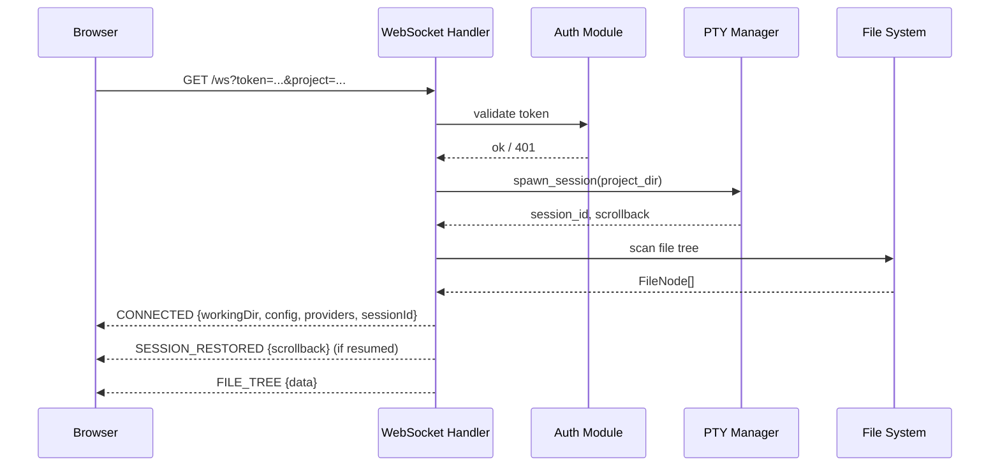
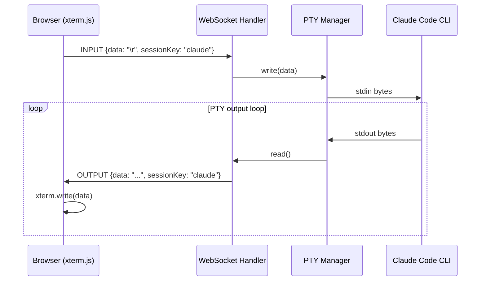
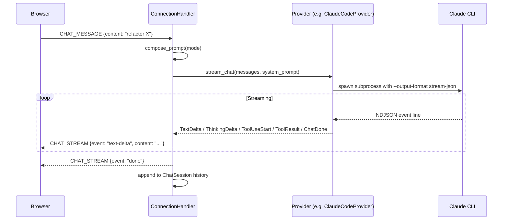
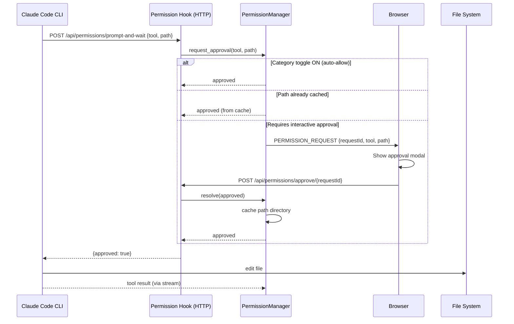
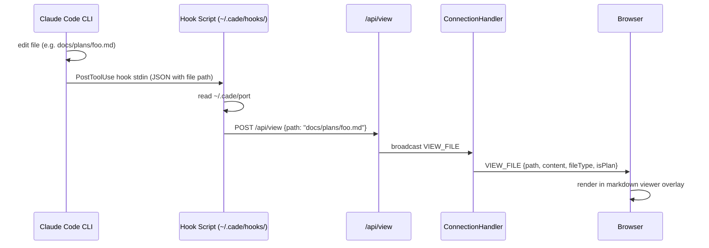
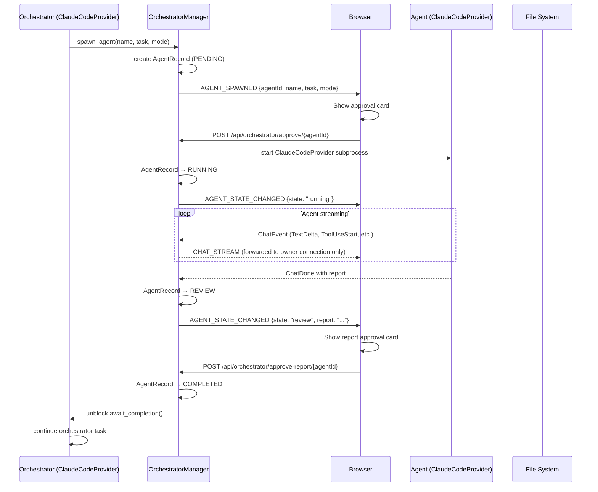
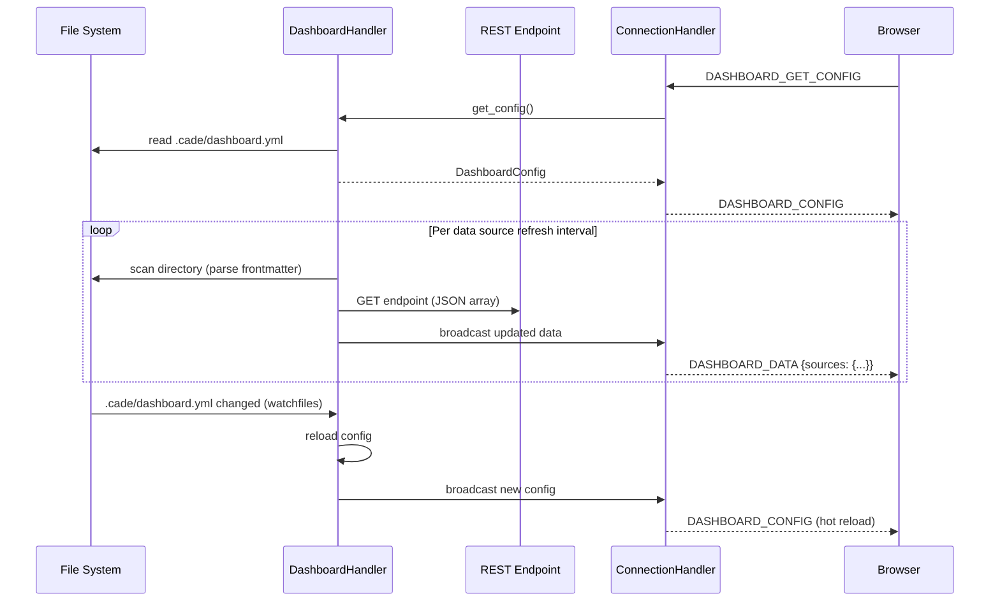
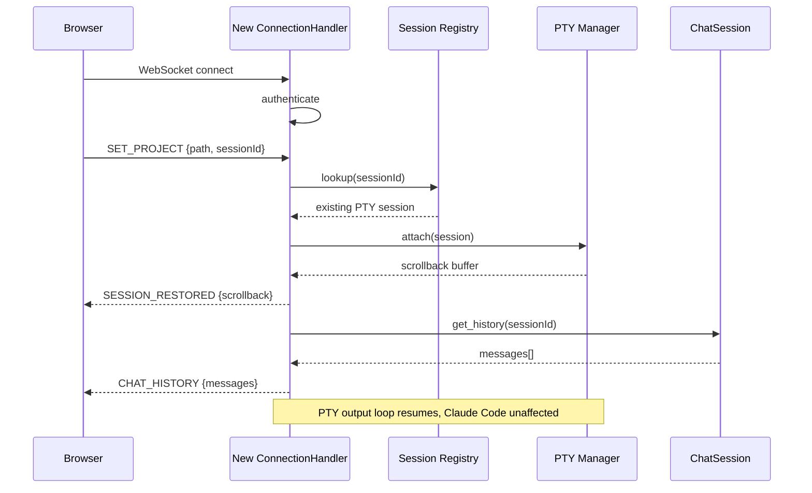

# Data Flow

Major data flows through CADE, from user input to system response.

## 1. WebSocket Connection & Authentication

When the frontend opens, it establishes a WebSocket connection to the backend and negotiates a project session.

If the session ID matches an existing PTY session, scrollback is replayed and the Claude Code process continues without interruption. A new project path triggers a fresh PTY spawn.

---

## 2. Terminal I/O

The primary Claude terminal is a PTY running `claude` (or a user-configured shell). Input and output flow as raw bytes.

The output loop runs as a long-lived async task for each session key (claude / manual). Resize messages (cols, rows) are forwarded as PTY window size changes.

---

## 3. Chat Message → LLM Streaming

Sending a chat message opens a provider stream and fans chat events to the client in real time.

`ThinkingDelta` events (extended thinking / reasoning tokens) are forwarded as a separate stream type and rendered in a collapsible block by the chat pane.

---

## 4. Tool Use with Permission Gate

When the LLM calls a file-editing tool, the request passes through permission checks before execution.

If the user denies, `ClaudeCodeProvider` receives `{approved: false}` and the tool call fails gracefully, which Claude Code handles by reporting the denial in its response.

---

## 5. File Change → Hook → Viewer

When Claude Code edits a file, a `PostToolUse` hook fires and CADE displays the result in the viewer pane.

The hook filter (configurable via `.cade/hook-filters.json`) controls which file paths trigger the viewer — either plan files only (`plans/**/*.md`) or all edits.

---

## 6. Agent Orchestration

Spawning an AI sub-agent follows a two-gate approval flow before the agent runs.

Output from the agent is sent **only** to the connection that spawned the orchestrator. This prevents cross-project leakage when multiple browser tabs are open to different projects.

---

## 7. Dashboard Data Polling

The dashboard hot-reloads from YAML config and polls data sources on configurable intervals.

---

## 8. Session Restore on Reconnect

When a browser tab reconnects (e.g. after a network blip), CADE restores the existing PTY session without restarting Claude Code.

## See Also

- [[overview|Architecture Overview]]
- [[components|Component Inventory]]
- [[../technical/reference/websocket-protocol|WebSocket Protocol Reference]]
- [[../technical/core/agent-orchestration|Agent Orchestration]]
