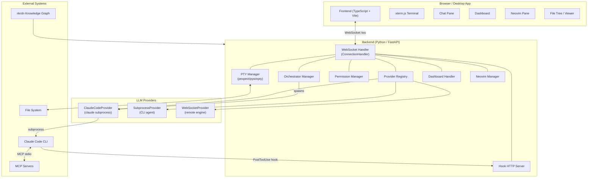

# CADE Architecture Overview

CADE (Claude Agentic Development Environment) is an agent-first development environment with Claude Code in a terminal shell as its centerpiece. It provides a unified workspace where AI-assisted development is the primary workflow — combining a persistent PTY terminal, structured chat rendering, file browsing, Neovim integration, a live dashboard, and multi-agent orchestration under one web-based interface.

## System Architecture Style

CADE is a **WebSocket-centric, event-driven** system. A single persistent WebSocket connection carries all communication between the browser frontend and the Python backend — terminal I/O, chat streaming, file operations, agent events, and permission prompts all flow through the same channel as typed message envelopes.

The backend is stateful per connection. Each `ConnectionHandler` owns a PTY session, a chat session, a provider registry, and all associated state for that browser tab. Multiple tabs get independent connections; multiple devices can share the same PTY session via session resumption.



## Technology Stack

| Layer | Technology | Purpose |
|-------|-----------|---------|
| Backend runtime | Python 3.11+ | Async I/O, PTY management, LLM streaming |
| Web framework | FastAPI + Uvicorn | HTTP + WebSocket server |
| LLM routing | LiteLLM | Multi-provider LLM API layer |
| Agent subprocess | Claude Code CLI | AI agent execution |
| MCP integration | mcp Python SDK | Tool servers via stdio |
| Frontend bundler | Vite + TypeScript | ES module build pipeline |
| Terminal rendering | xterm.js (Canvas/WebGL) | PTY output in browser |
| Markdown rendering | Milkdown | GFM + math + diagrams |
| Desktop wrapper | Tauri (Rust) | Native desktop packaging |
| PTY — Unix | pexpect | Pseudo-terminal on Linux/macOS |
| PTY — Windows | pywinpty | Pseudo-terminal on Windows/WSL |
| Knowledge graph | nkrdn | Code structure + doc indexing |
| File watching | watchfiles | File system change events |

## Key Design Decisions

### Single WebSocket Channel

All frontend-backend communication uses one WebSocket per browser tab. This avoids CORS complexities, keeps auth simple (token in URL), and makes session state coherent. The tradeoff is that all message types must share one wire; protocol discipline is enforced via typed `MessageType` enums with 95+ constants.

### Provider Abstraction

All LLM backends implement `BaseProvider` with a single `stream_chat()` interface. This lets the same chat UI work with Claude Code subprocess, arbitrary CLI programs, or persistent WebSocket game engines. The `ProviderRegistry` handles per-project overrides layered over global defaults from `~/.cade/providers.toml`.

### Permission Layers

Writes and tool calls are gated at two levels: **mode** (code/architect/review/orchestrator — set per session) and **category toggles** (allow_read, allow_write, allow_tools, allow_subagents — set interactively). Mode enforcement happens in Python before any provider call. Category enforcement uses a blocking HTTP call from the Claude Code hook to CADE's permission endpoint, showing a UI prompt to the user before proceeding.

### Session Persistence

PTY sessions survive WebSocket disconnects. On reconnect, the client sends a `SET_PROJECT` message and receives `SESSION_RESTORED` with scrollback buffer. Chat history is replayed from the in-memory `ChatSession` registry. UI state (open tabs, scroll positions) is persisted to `.cade/session.json`.

### Orchestrator Isolation

Agent subprocesses spawned by the orchestrator send output only to the owning connection — preventing cross-project leakage in multi-tab scenarios. Agents are held in `PENDING` state until the user explicitly approves, and final work summaries require a second approval before the orchestrator continues.

## Deployment Modes

| Mode | Description |
|------|-------------|
| Desktop app | Tauri wraps the FastAPI backend; single-user, no auth |
| Local web server | `cade serve` on localhost; browser connects directly |
| Remote server | Deployed behind nginx on EC2/VPS; auth token required |
| WSL (Windows) | Backend in WSL, browser on Windows host; path translation via wsl_path |

## Project Metrics

| Metric | Value |
|--------|-------|
| Backend Python | ~21,800 LOC |
| Frontend TypeScript | ~25,900 LOC |
| Core shared module | ~3,900 LOC |
| Total | ~51,600 LOC |
| WebSocket message types | 95+ |
| REST API endpoints | 40+ |
| Provider types | 3 (ClaudeCode, Subprocess, WebSocket) |
| Backend test files | 36 |
| Frontend test files | 1 |

## Directory Structure

```
cade/
├── backend/            # Python backend — FastAPI, WebSocket, PTY, providers
│   ├── main.py         # App factory + CLI entry point
│   ├── websocket.py    # ConnectionHandler — per-connection state machine
│   ├── protocol.py     # MessageType, SessionKey, ErrorCode enums
│   ├── config.py       # Server configuration loader
│   ├── auth.py         # Token + Google OAuth authentication
│   ├── chat/           # ChatSession registry + history
│   ├── dashboard/      # Dashboard config loader + data poller
│   ├── files/          # File I/O helpers
│   ├── hooks/          # Claude Code PostToolUse hook installer + HTTP handler
│   ├── neovim/         # Neovim PTY lifecycle manager
│   ├── terminal/       # PTY session management (pexpect/pywinpty)
│   ├── tools/          # FileToolExecutor — read/write/edit tools
│   ├── orchestrator/   # OrchestratorManager — agent spawn + approval flow
│   ├── permissions/    # PermissionManager — mode + category gate
│   ├── providers/      # ProviderRegistry + ClaudeCodeProvider
│   ├── prompts/        # Prompt composition + skill loading
│   ├── wsl/            # WSL path translation utilities
│   └── tests/          # pytest test suite (36 files)
├── core/               # Shared Python abstractions (providers, dashboard, session)
│   ├── backend/
│   │   ├── providers/  # BaseProvider, ChatEvent types, ToolDefinition
│   │   ├── chat/       # ChatSession dataclass + registry
│   │   └── dashboard/  # DashboardConfig schema + handler
│   └── frontend/       # Shared TypeScript platform types
├── frontend/           # TypeScript SPA — Vite, xterm.js, Milkdown
│   ├── src/
│   │   ├── main.ts         # App bootstrap + global state
│   │   ├── types.ts        # WebSocket message interfaces
│   │   ├── platform/       # WebSocketClient
│   │   ├── chat/           # Chat pane + permission prompts
│   │   ├── terminal/       # xterm.js wrapper + multi-terminal manager
│   │   ├── tabs/           # Tab bar + project context
│   │   ├── file-tree/      # File browser with lazy loading
│   │   ├── markdown/       # Milkdown viewer (GFM, math, diagrams)
│   │   ├── neovim/         # Neovim pane
│   │   ├── dashboard/      # Dashboard panel renderer
│   │   └── config/         # Theme + app config
│   └── styles/             # CSS (layout, themes, components)
├── desktop/            # Tauri desktop wrapper
│   └── src-tauri/      # Rust/Cargo — window, IPC, packaging
├── docs/               # Project documentation
├── .cade/              # Runtime state (session, port, dashboard config)
└── scripts/            # Build and deploy automation
```

## See Also

- [[components|Component Inventory]]
- [[data-flow|Data Flow]]
- [[dependencies|Dependencies]]
- [[../technical/reference/websocket-protocol|WebSocket Protocol Reference]]
- [[../technical/core/agent-orchestration|Agent Orchestration]]
