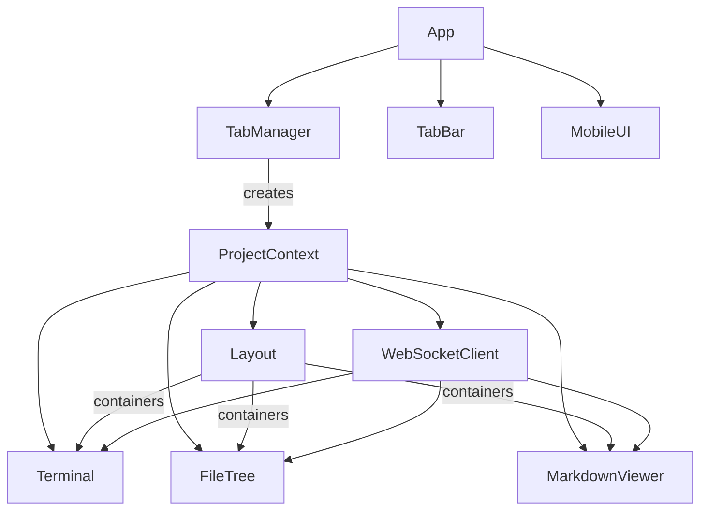

# Frontend Architecture

This document describes the CADE frontend component architecture, including the multi-tab system, responsive layout, and mobile support.

## Overview

The frontend is a TypeScript application built with Vite. It provides a tabbed terminal environment where each tab is an independent project context with its own terminal, file tree, and viewer.



## Tab System

The tab system enables multiple projects to be open simultaneously, each with isolated state.

### TabManager (`tabs/tab-manager.ts`)

Manages the collection of open tabs and persists tab state to localStorage.

**Responsibilities:**

- Creates and destroys project tabs
- Tracks active tab
- Persists tab list to localStorage
- Emits events for tab lifecycle changes

**Events:**

| Event | Data | Description |
|-------|------|-------------|
| `tab-created` | `TabState` | New tab was created |
| `tab-switched` | `TabState` | Active tab changed |
| `tabs-changed` | `TabState[]` | Tab list modified |

### TabBar (`tabs/tab-bar.ts`)

Renders the tab bar UI above the terminal pane.

**Features:**

- Displays project name for each tab
- Active tab styled to connect with content below (Obsidian aesthetic)
- Close button on hover
- Add (+) button to open new projects
- Tab bar grid syncs with layout proportions via CSS custom properties

### ProjectContext (`tabs/project-context.ts`)

Container for a single project's components. Each tab has one ProjectContext.

**Contains:**

- Layout instance
- Terminal instance
- FileTree instance
- MarkdownViewer instance
- WebSocketClient instance

**Lifecycle:**

1. Created when tab is added
2. Sends `SET_PROJECT` message to set working directory
3. Connects WebSocket
4. Shows/hides based on active tab
5. Disposed when tab is closed

## Components

### App (`main.ts`)

The main application orchestrator. Initializes the tab system and manages top-level lifecycle.

**Responsibilities:**

- Creates TabManager and TabBar
- Handles tab events (create, switch, close)
- Initializes ProjectContext for each tab
- Manages MobileUI
- Handles application disposal on page unload

### Layout (`layout.ts`)

Manages the three-pane desktop layout and responsive switching to mobile mode.

**Desktop Layout:**

- Three resizable panes: FileTree (20%), Terminal (50%), Viewer (30%)
- Draggable resize handles between panes
- Proportions persisted via session (see [[#Session Persistence]])
- Updates CSS custom properties for tab bar alignment

**CSS Custom Properties:**

When pane proportions change, Layout updates these CSS variables on `:root`:

| Variable | Description |
|----------|-------------|
| `--layout-file-tree` | File tree pane width (e.g., `20%`) |
| `--layout-terminal` | Terminal pane width (e.g., `50%`) |
| `--layout-viewer` | Viewer pane width (e.g., `30%`) |

The tab bar uses these variables for its grid columns, keeping tabs aligned above the terminal pane during resize.

**Mobile Layout:**

- Activated when viewport width <= 768px
- Hides FileTree, resize handles, Viewer panes, and tab bar
- Terminal expands to full viewport
- Adds `mobile-layout` class to container

**Key Methods:**

| Method | Description |
|--------|-------------|
| `isMobile()` | Returns true if viewport <= 768px |
| `getContainers()` | Returns references to pane DOM elements |
| `resetProportions()` | Restores default 20/50/30 split |

### Terminal (`terminal.ts`)

Wraps xterm.js to provide terminal emulation.

**Features:**

- Badwolf-inspired dark theme
- Automatic fit to container with ResizeObserver
- Keyboard input forwarded to server via WebSocket
- Receives output from server PTY
- Session restoration with scrollback replay

**Key Methods:**

| Method | Description |
|--------|-------------|
| `write(data)` | Write data to terminal |
| `clear()` | Clear scrollback buffer |
| `reset()` | Reset terminal state and clear for session replay |
| `focus()` | Focus the terminal |

**ChatPane — `prefillInput(text)`:**

Sets the chat input value and focuses it without submitting. Useful for verb-sheet and command-palette integrations that want to stage a command for the user to review before sending.

**Dependencies:**

- `@xterm/xterm` - Terminal emulator
- `@xterm/addon-fit` - Auto-resize support
- `@xterm/addon-web-links` - Clickable URLs
- `@xterm/addon-webgl` - WebGL renderer (with canvas fallback)

### FileTree (`file-tree.ts`)

Displays the project directory structure with vim-style keyboard navigation.

**Features:**

- Collapsible folder navigation
- Vim-style keyboard navigation (j/k/h/l/g/G)
- Incremental search with `/` key
- File type icons based on extension
- Visual highlight for recently changed files (2s duration)
- Emits `file-select` event when a file is clicked

**State Management:**

The file tree maintains navigation and search state internally. A pure state machine implementation exists in `file-tree-state.ts` for testing (see [[#File Tree State Machine]]).

**Key State:**

| Property | Description |
|----------|-------------|
| `selectedIndex` | Currently highlighted item index |
| `selectedPath` | Path of highlighted item |
| `expandedPaths` | Set of expanded directory paths |
| `searchMode` | Whether search is active |
| `searchInputFocused` | Whether typing in search input |
| `searchQuery` | Current filter text |
| `flatList` | Computed list of visible nodes |

**WebSocket Events:**

| Event | Action |
|-------|--------|
| `file-tree` | Updates tree data and re-renders |
| `file-change` | Highlights changed file, refreshes tree |

### MarkdownViewer (`markdown.ts`)

Renders file content with syntax highlighting.

**Features:**

- Basic markdown-to-HTML conversion
- Code block highlighting via highlight.js
- Wiki-link support (`[[path]]` syntax)
- Auto-refresh when viewed file changes

**Supported Markdown:**

- Headers (h1-h3)
- Bold, italic text
- Code blocks with language detection
- Inline code
- Unordered and ordered lists
- Blockquotes
- Standard and wiki-style links

**Wiki-link Syntax:**

| Syntax | Description |
|--------|-------------|
| `[[path]]` | Link using path as display text |
| `[[path\|display]]` | Link with custom display text |

**Return affordance — `setDashboardReturn(fn, label?)`:**

Registers a callback that returns the user to wherever they opened the current file from, rendering a `[← <label>]` button in the viewer header and wiring **Esc** to it. `label` defaults to `"dash"`. This single mechanism is reused by every surface that opens a file into the viewer — the dashboard (`[← dash]`) and the Plans & Handoffs pane (`[← plans]`) both call it; passing `null` clears the affordance (e.g. file-tree selection, which has no "back"). One button, one Esc handler, parameterised label.

**Wiki-link Path Resolution:**

Wiki-links are resolved relative to the current file's directory.

| Link | From File | Resolves To |
|------|-----------|-------------|
| `[[sibling]]` | `docs/user/README.md` | `docs/user/sibling.md` |
| `[[../README]]` | `docs/user/README.md` | `docs/README.md` |
| `[[subfolder/]]` | `docs/README.md` | `docs/subfolder/README.md` |
| `[[file.md]]` | Any | No extension added (already has one) |

Resolution rules:

1. **Extension handling**: `.md` is added automatically if the filename has no extension
2. **Directory links**: Paths ending with `/` resolve to `README.md` in that directory
3. **Relative paths**: `..` and `.` segments are normalized correctly
4. **Absolute paths**: Paths starting with `/` are used as-is (from project root)

### Plans & Handoffs Pane (`plans/plans-pane.ts`)

A right-pane mode (alongside markdown/neovim/agents/dashboard/memory-symbol in `RightPaneManager`) that surfaces the project's in-flight work: plan docs (`docs/plans/*.md`) and handoff briefs (`docs/plans/handoff/*.md`, where `/compact` writes them). It answers "what's in flight, and how do I resume it" without hunting the file tree.

**Layout** — a vim-airline / tmux-powerline *statusline* row: a hard status block on the left edge (the latest handoff is `ACTIVE` filled accent-red; the rest show a compact age in a grey `bg-tertiary` block), the `.md` title in markup-green, then inline `[path] [cli] [chat]` bracket actions. Bracket header `[ PLANS & HANDOFFS ]`, accent-red section labels — all per [[../design/visual-design-philosophy|the design bible]].

**Data** — `ws.requestPlansList()` ↔ the `plans-list` event (see [[../reference/websocket-protocol#Files]]). The backend (`_handle_get_plans_list`) globs both directories, derives a display title (frontmatter `title:` / first `# ` heading / filename), sorts each group newest-first, and flags the newest handoff `isLatest`. After `/compact` writes a handoff the backend re-emits `plans-list`, so the pane refreshes live.

**Row actions** (wired in `project-context.ts`):

| Action | Effect |
|--------|--------|
| click title | Opens the doc in the markdown viewer; offers `[← plans]` return (reuses `setDashboardReturn`) |
| `[path]` | Injects the relative path into the live input (CLI terminal, or chat box in enhanced mode) without submitting |
| `[cli]` | Spawns a **new tab** running the Claude Code CLI, seeded via `claude "Read <path> and continue…"` |
| `[chat]` | Spawns a **new tab** in enhanced chat, primed with the handoff as the opening message |

**New-tab priming** extends tab creation: `TabManager.createTab(path, { initialPrompt?, chatHandoff? })` carries one-shot seeds (never persisted to localStorage) via `set-project`. The CLI seed is consumed backend-side in the `claude` launch (`terminal/sessions.py` + the WSL deferred-start path); the chat seed is replayed frontend-side as a normal `chat-message` on `connected`, so it works for any provider rather than depending on a specific chat backend.

### MobileUI (`mobile.ts`)

Orchestrates mobile-specific UI. Lazy-initialized per tab on the first WebSocket connection.

**Screen stack model:**

Mobile navigation is a stack of full-pane screens managed by `ScreenManager` (`ui/mobile/screen-manager.ts`). The terminal is the implicit base layer — never pushed. Each screen implements the `MobileScreen` interface (`element`, `onShow()`, `onHide()`, `dispose()`); `push()` shows a screen and hides the one beneath it, `pop()` / `popToRoot()` reverse it. Crossing the breakpoint back to desktop empties the stack.

| Screen | File | Purpose |
|--------|------|---------|
| CommandMenu | `ui/mobile/command-menu.ts` | Full-pane menu: files, viewer, dashboard, tab list, reconnect, theme. Vim-style `MenuNav` keys. Replaces the former bottom-sheet overflow menu. |
| FileExplorer | `ui/mobile/file-explorer.ts` | Nested file-tree browser; tapping a file pushes a FileViewer |
| FileViewer | `ui/mobile/file-viewer.ts` | Syntax-highlighted code / rendered markdown |
| DashboardScreen | `ui/mobile/dashboard-screen.ts` | Config-driven dashboard (see [Dashboard on Mobile](#dashboard-on-mobile)) |

**Touch Toolbar (`touch-toolbar.ts`):**

Fixed 6-button bar at the bottom: `esc`, `tab`, `^c`, `^d`, `↑`, `[cmd]`. The first five send the corresponding key to the terminal; `[cmd]` opens the CommandMenu (and toggles it closed if already open). A notification dot on `[cmd]` signals a changed markdown file or a newly arrived dashboard payload; opening the menu clears it. The toolbar repositions above the virtual keyboard via the `visualViewport` API.

**Back navigation:** every screen supports swipe-right-from-edge and the `h` / `Backspace` / `Escape` keys.

## Keyboard Input Handling

The keyboard system routes input based on context: prefix mode for global commands, pane handlers for focused component actions.

### KeybindingManager (`keybindings.ts`)

Central keyboard input router. Uses capture phase to intercept before xterm.js.

**Responsibilities:**

- Detect prefix key (`Ctrl+a`) and activate prefix mode
- Route post-prefix keys to global commands
- Delegate non-prefix keys to focused pane's handler
- Respect input elements (skip when typing in forms)

**Prefix Mode State:**

```
┌──────────────┐  Ctrl+a   ┌──────────────┐
│    NORMAL    │ ────────► │    PREFIX    │
│              │           │  (2s timeout) │
└──────────────┘           └──────┬───────┘
       ▲                          │
       │        any key           │
       └──────────────────────────┘
```

**PaneKeyHandler Interface:**

Components that handle keyboard input implement this interface:

```typescript
interface PaneKeyHandler {
  handleKeydown(e: KeyboardEvent): boolean;
}
```

Returns `true` if the key was handled (prevents propagation).

**Key Routing Logic:**

1. Prefix key (`Ctrl+a`) → activate prefix mode, consume event
2. Prefix active + any key → route to global command, consume event
3. Input element focused → let event through
4. Terminal focused → let event through (terminal handles it)
5. Other pane focused → delegate to pane's `handleKeydown()`

### File Tree State Machine

The file tree has three keyboard modes for search and navigation.

**States:**

| State | Description |
|-------|-------------|
| `off` | Normal tree navigation, vim keys active |
| `typing` | Search input focused, typing filters tree |
| `navigating` | Search visible but unfocused, vim keys navigate filtered results |

**State Transitions:**

```
┌─────────────────┐
│       OFF       │  (normal tree view)
│  vim keys work  │
└────────┬────────┘
         │ press /
         ▼
┌─────────────────┐
│     TYPING      │  (search input focused)
│  type to filter │
└────────┬────────┘
         │ press Enter
         ▼
┌─────────────────┐
│   NAVIGATING    │  (search visible, vim keys work)
│ filtered results│
└─────────────────┘
```

**Transitions:**

| From | Event | To | Action |
|------|-------|----|--------|
| OFF | `/` | TYPING | Show search input, focus it |
| TYPING | `Enter` | NAVIGATING | Select first result, blur input |
| TYPING | `Escape` | OFF | Clear search, hide input |
| NAVIGATING | `/` | TYPING | Refocus input for refinement |
| NAVIGATING | `Escape` | OFF | Clear search, hide input |
| NAVIGATING | `j`/`k` | NAVIGATING | Move selection in filtered list |

**Implementation Notes:**

- State tracked via `searchMode` and `searchInputFocused` properties
- `render()` recreates DOM each time; focus managed by state flags, not DOM queries
- `buildFlatList()` filters tree based on search query
- Pure state logic extracted to `file-tree-state.ts` for testability

### Vim Navigation Keys

Both FileTree and Viewer support vim-style navigation when focused.

**FileTree Keys:**

| Key | Action |
|-----|--------|
| `j` / `↓` | Move selection down |
| `k` / `↑` | Move selection up |
| `l` / `Enter` | Expand directory or open file |
| `h` | Collapse directory or go to parent |
| `gg` | Jump to top (two `g` presses within 500ms) |
| `G` | Jump to bottom |
| `/` | Enter search mode |

**Viewer Keys:**

| Key | Action |
|-----|--------|
| `j` / `↓` | Scroll down |
| `k` / `↑` | Scroll up |
| `gg` | Scroll to top |
| `G` | Scroll to bottom |

## WebSocket Communication

The `WebSocketClient` class manages server communication with automatic reconnection.

**Dev Testing — `injectEvent(type, data)`:**

A `DEV`-only method on `WebSocketClient` that fires a synthetic inbound event as if the server sent it. Lets you drive the UI from the console or a `?demo=<scenario>` URL parameter without a real server connection.

```typescript
// In browser console (dev builds only):
ws.injectEvent("connected", { type: "connected", workingDir: "/", resumed: false });
ws.injectEvent("dashboard-data", { sources: { ... } });
```

Bridged lifecycle events (`connected`, `disconnected`, `auth-failed`, etc.) are routed through `fireBridged` automatically; all other events go through the normal `dispatch` registry. `fireBridged` is `protected` so subclasses can fire bridged events too.

**GraphComponent — bounds auto-derivation:**

`dashboard-data` payloads that include a `game_map` source may omit `bounds`. `GraphComponent` derives bounds from node `x/y` coordinates automatically when the server omits them, and null-coalesces missing `x/y/z` fields to `0`. Server-provided bounds take precedence when present.

**Client Messages:**

| Type | Purpose |
|------|---------|
| `set-project` | Set working directory for this connection |
| `input` | Send terminal keystrokes |
| `resize` | Send terminal dimensions |
| `get-tree` | Request file tree |
| `get-file` | Request file content |
| `save-session` | Persist session state |

**Server Messages:**

| Type | Purpose |
|------|---------|
| `connected` | Confirms connection, provides working directory and session |
| `session-restored` | Sent when reconnecting to existing PTY, includes scrollback |
| `output` | Terminal output data |
| `file-tree` | Directory structure |
| `file-content` | Requested file content |
| `file-change` | File system change notification |
| `error` | Error with code and message |

**Reconnection:**

- Exponential backoff starting at base delay
- Maximum attempts before giving up
- Configuration via `config.ts`

## Session Persistence

### Terminal Session Persistence

PTY sessions persist across browser refreshes and reconnections. When a WebSocket disconnects, the backend keeps the PTY process alive and captures output to a scrollback buffer.

**How it works:**

1. Each tab has a unique session ID (UUID) stored in localStorage
2. On reconnect, the frontend sends this ID with `SET_PROJECT`
3. Backend finds the existing PTY session and sends accumulated scrollback
4. Frontend receives `session-restored` message and replays scrollback

**Scrollback Sanitization:**

Before replaying scrollback, the backend filters terminal query sequences that would cause xterm.js to send responses back to the PTY. These sequences would otherwise appear as typed input.

Filtered sequences include:

| Sequence | Name | Description |
|----------|------|-------------|
| `ESC c` | RIS | Reset to Initial State |
| `CSI c` | DA1 | Primary Device Attributes |
| `CSI > c` | DA2 | Secondary Device Attributes |
| `CSI n` | DSR | Device Status Report |
| `CSI ? n` | DECXCPR | Extended Cursor Position Report |

**Frontend Reset:**

Before writing scrollback, the terminal resets its state to avoid corruption from partial escape sequences:

```
SGR 0        - Reset text attributes
CSI ?1049l   - Exit alternate screen buffer
CSI r        - Reset scroll margins
CSI H CSI 2J - Cursor home + clear screen
```

This ensures clean replay regardless of what state the terminal was in when captured.

### UI Session Persistence

UI state is persisted per-project in `.cade/session.json`. This allows layout and file tree state to survive browser refreshes.

**Persisted State:**

| Property | Description |
|----------|-------------|
| `expandedPaths` | Array of expanded folder paths in file tree |
| `viewerPath` | Currently viewed file path |
| `layout` | Pane proportions (fileTree, terminal, viewer) |

**Session Schema:**

```json
{
  "version": 1,
  "expandedPaths": ["docs", "docs/technical"],
  "viewerPath": "docs/README.md",
  "layout": {
    "fileTree": 0.2,
    "terminal": 0.5,
    "viewer": 0.3
  }
}
```

**Lifecycle:**

1. On `connected`, server sends existing session (if any)
2. After `file-tree` loads, session state is restored
3. State changes trigger debounced save (500ms)
4. On `beforeunload`, session is saved immediately

**Storage Location:**

- File: `<project>/.cade/session.json`
- The `.CADE` directory is hidden from the file tree

## Mobile Support

### Detection

Mobile mode triggers at viewport width <= 768px. This breakpoint is defined in:

- `layout.ts`: `MOBILE_BREAKPOINT` constant
- `mobile.ts`: `MOBILE_BREAKPOINT` constant
- `main.css`: `@media (max-width: 768px)`

### Layout Switching

When crossing the breakpoint:

1. **Desktop to Mobile:**
   - Layout adds `mobile-layout` class
   - CSS hides FileTree, resize handles, Viewer, and tab bar
   - Terminal expands to full viewport with 48px reserved for touch toolbar
   - MD button, touch toolbar, and overflow menu become available
   - Uses `100dvh` (dynamic viewport height) to handle mobile browser chrome

2. **Mobile to Desktop:**
   - Layout removes `mobile-layout` class
   - Three-pane grid layout restored
   - Mobile UI elements hidden
   - Any open slide-out automatically closes

### Safe Area & Viewport

- `viewport-fit=cover` meta tag enables edge-to-edge rendering
- CSS uses `env(safe-area-inset-bottom)` for notched devices
- Touch toolbar and overflow menu respect safe area insets
- Virtual keyboard detection via `visualViewport` API repositions the toolbar

### Multi-Device Sessions

Mobile and desktop clients can connect to the same server session simultaneously. The WebSocket protocol enables:

- Shared terminal session (PTY)
- Synchronized file tree updates
- Real-time file change notifications across all clients
- Independent file viewing per client

### Dashboard on Mobile

The config-driven dashboard (`dashboard/dashboard-pane.ts`) is desktop-first: it renders into the right pane (hidden < 768px) and into a full-width `.dashboard-full-container` used by the desktop "dashboard view" toggle. `DashboardScreen` (`ui/mobile/dashboard-screen.ts`) makes it reachable on a phone as a screen on the stack.

**Borrow, don't fork.** `tabs/project-context.ts` already feeds every `dashboard-*` WebSocket event to *two* `DashboardPane` instances — the right-pane one and the always-synced full-width one (`dashboardFullPane`, rendered into `.dashboard-full-container`, `display:none` until the desktop toggle). Rather than create a third instance and a third WS feed, `DashboardScreen.onShow()` reparents the existing `.dashboard-full-container` into its screen body and `onHide()` returns it to its original parent with `display:none` restored. Consequence: dashboard state, scroll position, and the single WS subscription are preserved across open/close, and there is exactly one place dashboard data is wired.

`ProjectContext.getDashboardFullContainer()` exposes the element (null until a config loads); `MobileUI` reaches it through `MobileUICallbacks` set in `main.ts`. The `[dashboard]` command-menu entry only appears when `hasDashboard()` is true. Arrival of `dashboard-config` / `dashboard-data` while mobile flags the existing `[cmd]` indicator — consistent with the file-change pattern, chosen over auto-opening so the dashboard never interrupts the terminal.

**Responsive layout.** `styles/workspace/dashboard.css` is otherwise desktop-only; a single `@media (max-width: 768px)` block at the end of that file (kept co-located since the file is self-contained) collapses the masonry `grid-2col`/`grid-3col` layouts to one column, unsets `column-span` on full-width panels, stacks kanban lanes vertically (horizontal lanes are unusable on a phone), enlarges basket steppers to real touch targets, and gives tables momentum scroll.

**Touch interaction.** HTML5 drag-and-drop events do not fire on touch. `dashboard/components/kanban.ts` adds touch-drag (track finger travel; a short move falls through to the existing tap → move-menu, a longer one drags with `elementFromPoint` hit-testing) that *coexists* with the desktop HTML5 DnD path — the shared move logic is factored into `applyMove()`. Basket and entity-detail were already click-driven, so they work on touch unchanged; the responsive CSS only enlarges their hit areas.

**Boundary:** this covers the dashboard *container and layout*. Individual component internals live with each component in `dashboard/components/`. The interactive `world_detail` / `npc_detail` components are Padarax-owned (`frontend/src/padarax/`) and are not modified here — they inherit the responsive CSS and their existing click handlers.

## File Structure

```
frontend/
├── src/
│   ├── main.ts              # App entry point
│   ├── tabs/                # Tab system
│   │   ├── index.ts         # Public exports
│   │   ├── tab-manager.ts   # Tab state management
│   │   ├── tab-bar.ts       # Tab bar UI
│   │   ├── project-context.ts # Per-project container
│   │   └── types.ts         # Tab-related types
│   ├── layout.ts            # Layout management
│   ├── terminal.ts          # Terminal component
│   ├── terminal-manager.ts  # Terminal instance management
│   ├── file-tree.ts         # File tree component
│   ├── file-tree-state.ts   # Pure file tree state machine (testable)
│   ├── file-tree-state.test.ts # File tree state tests
│   ├── keybindings.ts       # Keyboard input routing
│   ├── user-config.ts       # User configuration loading
│   ├── markdown.ts          # Markdown viewer
│   ├── ui/
│   │   ├── mobile.ts        # Mobile UI orchestrator
│   │   ├── touch-toolbar.ts # Bottom touch button bar
│   │   ├── overflow-menu.ts # Bottom sheet actions menu
│   │   └── splash.ts        # Startup splash screen
│   ├── websocket.ts         # WebSocket client
│   ├── types.ts             # TypeScript interfaces
│   ├── protocol.ts          # Message type constants
│   └── config.ts            # Configuration
├── styles/
│   └── main.css             # All styles including tabs and mobile
├── vitest.config.ts         # Test configuration
└── index.html               # HTML template
```

## See Also

- [[../README|Technical Documentation Index]]
- [[../../user/README|User Guide]]
