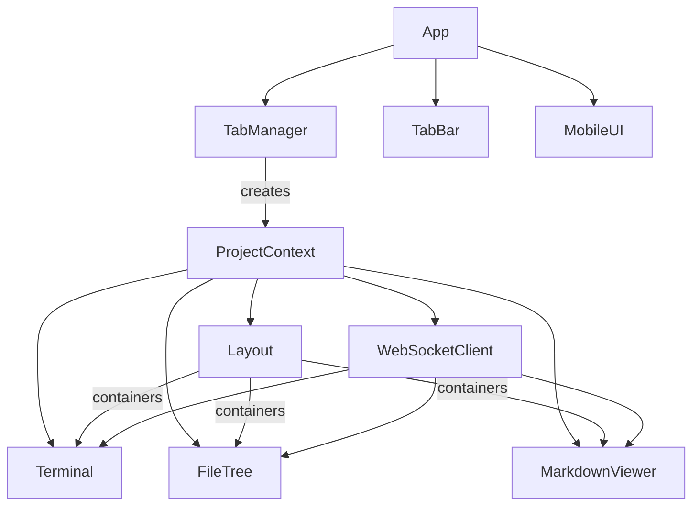

# Frontend Architecture

This document describes the ccplus frontend component architecture, including the multi-tab system, responsive layout, and mobile support.

## Overview

The frontend is a TypeScript application built with Vite. It provides a tabbed terminal environment where each tab is an independent project context with its own terminal, file tree, and viewer.



## Tab System

The tab system enables multiple projects to be open simultaneously, each with isolated state.

### TabManager (`tabs/tab-manager.ts`)

Manages the collection of open tabs and persists tab state to localStorage.

**Responsibilities:**

- Creates and destroys project tabs
- Tracks active tab
- Persists tab list to localStorage
- Emits events for tab lifecycle changes

**Events:**

| Event | Data | Description |
|-------|------|-------------|
| `tab-created` | `TabState` | New tab was created |
| `tab-switched` | `TabState` | Active tab changed |
| `tabs-changed` | `TabState[]` | Tab list modified |

### TabBar (`tabs/tab-bar.ts`)

Renders the tab bar UI above the terminal pane.

**Features:**

- Displays project name for each tab
- Active tab styled to connect with content below (Obsidian aesthetic)
- Close button on hover
- Add (+) button to open new projects
- Tab bar grid syncs with layout proportions via CSS custom properties

### ProjectContext (`tabs/project-context.ts`)

Container for a single project's components. Each tab has one ProjectContext.

**Contains:**

- Layout instance
- Terminal instance
- FileTree instance
- MarkdownViewer instance
- WebSocketClient instance

**Lifecycle:**

1. Created when tab is added
2. Sends `SET_PROJECT` message to set working directory
3. Connects WebSocket
4. Shows/hides based on active tab
5. Disposed when tab is closed

## Components

### App (`main.ts`)

The main application orchestrator. Initializes the tab system and manages top-level lifecycle.

**Responsibilities:**

- Creates TabManager and TabBar
- Handles tab events (create, switch, close)
- Initializes ProjectContext for each tab
- Manages MobileUI
- Handles application disposal on page unload

### Layout (`layout.ts`)

Manages the three-pane desktop layout and responsive switching to mobile mode.

**Desktop Layout:**

- Three resizable panes: FileTree (20%), Terminal (50%), Viewer (30%)
- Draggable resize handles between panes
- Proportions persisted via session (see [[#Session Persistence]])
- Updates CSS custom properties for tab bar alignment

**CSS Custom Properties:**

When pane proportions change, Layout updates these CSS variables on `:root`:

| Variable | Description |
|----------|-------------|
| `--layout-file-tree` | File tree pane width (e.g., `20%`) |
| `--layout-terminal` | Terminal pane width (e.g., `50%`) |
| `--layout-viewer` | Viewer pane width (e.g., `30%`) |

The tab bar uses these variables for its grid columns, keeping tabs aligned above the terminal pane during resize.

**Mobile Layout:**

- Activated when viewport width <= 768px
- Hides FileTree, resize handles, Viewer panes, and tab bar
- Terminal expands to full viewport
- Adds `mobile-layout` class to container

**Key Methods:**

| Method | Description |
|--------|-------------|
| `isMobile()` | Returns true if viewport <= 768px |
| `getContainers()` | Returns references to pane DOM elements |
| `resetProportions()` | Restores default 20/50/30 split |

### Terminal (`terminal.ts`)

Wraps xterm.js to provide terminal emulation.

**Features:**

- VS Code-inspired dark theme
- Automatic fit to container with ResizeObserver
- Keyboard input forwarded to server via WebSocket
- Receives output from server PTY

**Dependencies:**

- `@xterm/xterm` - Terminal emulator
- `@xterm/addon-fit` - Auto-resize support
- `@xterm/addon-web-links` - Clickable URLs

### FileTree (`file-tree.ts`)

Displays the project directory structure.

**Features:**

- Collapsible folder navigation
- File type icons based on extension
- Visual highlight for recently changed files (2s duration)
- Emits `file-select` event when a file is clicked

**WebSocket Events:**

| Event | Action |
|-------|--------|
| `file-tree` | Updates and re-renders the tree |
| `file-change` | Highlights changed file, refreshes tree |

### MarkdownViewer (`markdown.ts`)

Renders file content with syntax highlighting.

**Features:**

- Basic markdown-to-HTML conversion
- Code block highlighting via highlight.js
- Wiki-link support (`[[path]]` syntax)
- Auto-refresh when viewed file changes

**Supported Markdown:**

- Headers (h1-h3)
- Bold, italic text
- Code blocks with language detection
- Inline code
- Unordered and ordered lists
- Blockquotes
- Standard and wiki-style links

**Wiki-link Syntax:**

| Syntax | Description |
|--------|-------------|
| `[[path]]` | Link using path as display text |
| `[[path\|display]]` | Link with custom display text |

**Wiki-link Path Resolution:**

Wiki-links are resolved relative to the current file's directory.

| Link | From File | Resolves To |
|------|-----------|-------------|
| `[[sibling]]` | `docs/user/README.md` | `docs/user/sibling.md` |
| `[[../README]]` | `docs/user/README.md` | `docs/README.md` |
| `[[subfolder/]]` | `docs/README.md` | `docs/subfolder/README.md` |
| `[[file.md]]` | Any | No extension added (already has one) |

Resolution rules:

1. **Extension handling**: `.md` is added automatically if the filename has no extension
2. **Directory links**: Paths ending with `/` resolve to `README.md` in that directory
3. **Relative paths**: `..` and `.` segments are normalized correctly
4. **Absolute paths**: Paths starting with `/` are used as-is (from project root)

### MobileUI (`mobile.ts`)

Provides mobile-specific interface elements.

**Elements:**

| Element | Purpose |
|---------|---------|
| MD Button | Floating action button to open viewer |
| Slide-out Panel | Off-canvas panel for viewing content |
| Backdrop | Dismisses slide-out when tapped |

**Button States:**

- **Outline** (default): No new content available
- **Solid Blue** (`has-update` class): Markdown file changed, pulsing animation

**Slide-out Behavior:**

1. Tap MD button to open panel
2. If updates pending, loads the changed file
3. Otherwise, shows previously viewed file
4. Tap backdrop or close button to dismiss

## WebSocket Communication

The `WebSocketClient` class manages server communication with automatic reconnection.

**Client Messages:**

| Type | Purpose |
|------|---------|
| `set-project` | Set working directory for this connection |
| `input` | Send terminal keystrokes |
| `resize` | Send terminal dimensions |
| `get-tree` | Request file tree |
| `get-file` | Request file content |
| `save-session` | Persist session state |

**Server Messages:**

| Type | Purpose |
|------|---------|
| `connected` | Confirms connection, provides working directory and session |
| `output` | Terminal output data |
| `file-tree` | Directory structure |
| `file-content` | Requested file content |
| `file-change` | File system change notification |
| `error` | Error with code and message |

**Reconnection:**

- Exponential backoff starting at base delay
- Maximum attempts before giving up
- Configuration via `config.ts`

## Session Persistence

Session state is persisted per-project in `.ccplus/session.json`. This allows UI state to survive browser refreshes.

**Persisted State:**

| Property | Description |
|----------|-------------|
| `expandedPaths` | Array of expanded folder paths in file tree |
| `viewerPath` | Currently viewed file path |
| `layout` | Pane proportions (fileTree, terminal, viewer) |

**Session Schema:**

```json
{
  "version": 1,
  "expandedPaths": ["docs", "docs/technical"],
  "viewerPath": "docs/README.md",
  "layout": {
    "fileTree": 0.2,
    "terminal": 0.5,
    "viewer": 0.3
  }
}
```

**Lifecycle:**

1. On `connected`, server sends existing session (if any)
2. After `file-tree` loads, session state is restored
3. State changes trigger debounced save (500ms)
4. On `beforeunload`, session is saved immediately

**Storage Location:**

- File: `<project>/.ccplus/session.json`
- The `.ccplus` directory is hidden from the file tree

## Mobile Support

### Detection

Mobile mode triggers at viewport width <= 768px. This breakpoint is defined in:

- `layout.ts`: `MOBILE_BREAKPOINT` constant
- `mobile.ts`: `MOBILE_BREAKPOINT` constant
- `main.css`: `@media (max-width: 768px)`

### Layout Switching

When crossing the breakpoint:

1. **Desktop to Mobile:**
   - Layout adds `mobile-layout` class
   - CSS hides FileTree, resize handles, Viewer
   - Terminal expands to 100% viewport
   - MD button becomes visible

2. **Mobile to Desktop:**
   - Layout removes `mobile-layout` class
   - Three-pane grid layout restored
   - MD button and slide-out hidden
   - Any open slide-out automatically closes

### Multi-Device Sessions

Mobile and desktop clients can connect to the same server session simultaneously. The WebSocket protocol enables:

- Shared terminal session (PTY)
- Synchronized file tree updates
- Independent file viewing per client

## File Structure

```
frontend/
├── src/
│   ├── main.ts           # App entry point
│   ├── tabs/             # Tab system
│   │   ├── index.ts      # Public exports
│   │   ├── tab-manager.ts    # Tab state management
│   │   ├── tab-bar.ts        # Tab bar UI
│   │   ├── project-context.ts # Per-project container
│   │   └── types.ts          # Tab-related types
│   ├── layout.ts         # Layout management
│   ├── terminal.ts       # Terminal component
│   ├── file-tree.ts      # File tree component
│   ├── markdown.ts       # Markdown viewer (mertex.md)
│   ├── mobile.ts         # Mobile UI component
│   ├── websocket.ts      # WebSocket client
│   ├── types.ts          # TypeScript interfaces
│   ├── protocol.ts       # Message type constants
│   └── config.ts         # Configuration
├── styles/
│   └── main.css          # All styles including tabs and mobile
└── index.html            # HTML template
```

## See Also

- [[../README|Technical Documentation Index]]
- [[../../user/mobile|Mobile User Guide]]
