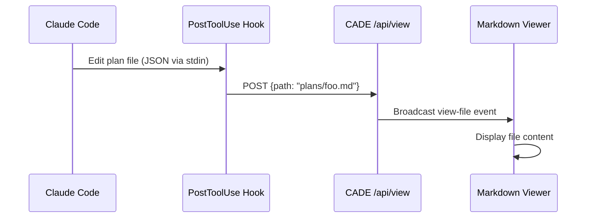

# Plan Viewer

The plan viewer provides instant visibility into Claude's planning process. You can view plan files:

1. **Automatically** via a Claude Code hook when files are edited
2. **On-demand** via `Ctrl+g` to view the most recent plan

## Keyboard Shortcut

Press `Ctrl+g` anywhere in CADE to instantly view the most recently modified plan file from `~/.claude/plans/`. This works even when Claude is actively editing plans.

## Automatic Hook

The plan viewer hook automatically displays plan files in the CADE viewer whenever Claude Code creates or edits them.

### How It Works

When configured, Claude Code triggers a hook after each file edit. The hook reads the file path from stdin (JSON format) and sends a request to CADE, which displays the file in the markdown viewer.



### Prerequisites

- CADE running (via `make dev` or `CADE serve`)
- `curl` and `python3` available in your terminal
- Claude Code installed and configured

### Quick Setup

Run the setup command from your terminal:

```bash
# If CADE is installed (pip install -e .)
CADE setup-hook

# Or run directly from the project directory
python -m backend.main setup-hook
```

This automatically configures the Claude Code hook to send plan files to the viewer.

> [!NOTE]
> When running from Windows, the setup command automatically writes to your WSL home directory (`~/.claude/settings.json` inside WSL), not the Windows home directory.

### Options

| Flag | Description |
|------|-------------|
| `--all-files` | View all file edits, not just plans |
| `--port PORT` | Custom server port (default: 3001) |
| `--dry-run` | Show what would be changed without modifying settings |

### Example Output

```
Backed up existing settings to ~/.claude/settings.json.backup
Added PostToolUse hook for plan file viewing
Hook configured to POST plan files (plans/*.md) to http://localhost:3001/api/view
```

## Manual Setup

If you prefer to configure the hook manually, add this to `~/.claude/settings.json`:

### Plan Files Only (Recommended)

```json
{
  "hooks": {
    "PostToolUse": [
      {
        "matcher": "Edit|Write",
        "hooks": [
          {
            "type": "command",
            "command": "python3 -c \"import sys,json; p=json.load(sys.stdin)['tool_input']['file_path']; print(p) if 'plans/' in p and p.endswith('.md') else None\" 2>/dev/null | xargs -r -I {} curl -s -X POST -H 'Content-Type: application/json' -d '{\"path\":\"{}\"}' http://localhost:3001/api/view > /dev/null"
          }
        ]
      }
    ]
  }
}
```

### All File Edits

```json
{
  "hooks": {
    "PostToolUse": [
      {
        "matcher": "Edit|Write",
        "hooks": [
          {
            "type": "command",
            "command": "python3 -c \"import sys,json; print(json.load(sys.stdin)['tool_input']['file_path'])\" | xargs -I {} curl -s -X POST -H 'Content-Type: application/json' -d '{\"path\":\"{}\"}' http://localhost:3001/api/view > /dev/null"
          }
        ]
      }
    ]
  }
}
```

## Configuration

### Changing the Port

If the server runs on a different port, update the hook:

1. Using the setup command: `python -m backend.main setup-hook --port 8080`
2. Manually: Change `localhost:3001` in the hook command

### Filtering Files

The default hook only triggers for files in `plans/` directories with `.md` extension. To customize:

1. Modify the `grep` pattern in the hook command
2. Or use `--all-files` to view everything

## Troubleshooting

For detailed troubleshooting steps, see [[hook-troubleshooting|Hook Troubleshooting Guide]].

### Quick Checks

1. **Check CADE is running**: The server must be active at the configured port
2. **Check the port**: Verify the hook uses the same port as CADE
3. **Verify WSL connectivity**: From WSL, test `curl http://$(ip route show default | awk '{print $3}'):3001/`
4. **Restart Claude Code**: Hooks only load on startup

### Common Issues

**Hook not triggering:**
- Verify hook is in `~/.claude/settings.json` (WSL home, not Windows home)
- Restart Claude Code after modifying settings

**Connection refused:**
- Server must listen on `0.0.0.0` (default as of v0.1.0)
- WSL must use Windows gateway IP, not `localhost`
- Windows firewall may need to allow port 3001

See [[hook-troubleshooting|Hook Troubleshooting Guide]] for detailed solutions.

## Removing the Hook

To disable the plan viewer hook:

1. Edit `~/.claude/settings.json`
2. Remove the `PostToolUse` entry (or the specific hook)
3. Restart Claude Code

## See Also

- [[configuration|Configuration Guide]]
- [[README|User Guide]]
